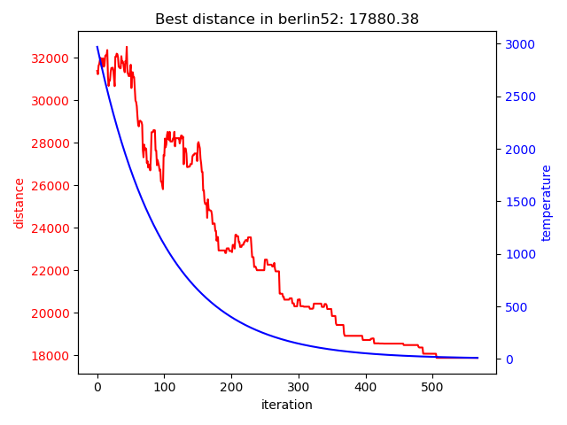

## Simulated annealing algorithm for travelling salesman problem

Program includes two classes:
* datasets
* simulated annealing

Datasets used in experiments are avaliable [here](https://wwwproxy.iwr.uni-heidelberg.de/groups/comopt/software/TSPLIB95/STSP.html).

Usage of algorithm:

`SA = SimulatedAnnealing(data, name)`

`stats = SA(t_start=3000, t_min=10)`

Example visualisation of performed experiment:

This is an implementation oh heuristic described [here](https://tdb0.wordpress.com/2010/12/03/symulowane-wyzarzanie/)
